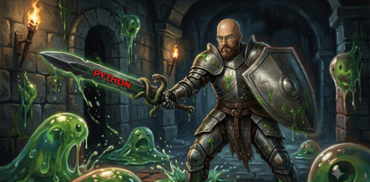

# ML-Dungeon

</img>

 

Here's **ML Dungeon** — a 3-level RPG built around a dungeon-crawler:

- **Level 1, Slime Caverns** — 3 slimes, questions on overfitting, train/test splits, and features
- **Level 2, Bone Crypt** — 3 skeletons, questions on bias-variance tradeoff, regularization, and cross-validation
- **Level 3, Wizard's Tower** — final boss fight (5-question HP bar) covering gradient descent, precision/recall, tree pruning, KNN, and ensemble methods

Each scene has a custom SVG background and character (hand-drawn, not stock photos, so they fit the pixel-torch dungeon aesthetic), flickering torches, a bobbing character animation, a hearts system (3 lives, lose one per wrong answer), and a boss health bar that breaks down per correct answer. Wrong or right, you get an explanation before moving on, so it teaches as you play.

Open the file to try it — click "Begin Quest" to start.

 

---

This game can be a nice sandbox for teaching AI engineering concepts, since you can wire real API calls into the artifact itself. Here are 8 ways to layer AI on top of it, roughly ordered from "quick win" to "meaningful engineering exercise":

1. **Dynamic question generation** — instead of a fixed question bank, call the Claude API at runtime to generate new ML questions on a given topic/difficulty. Teaches prompt engineering and structured output (forcing JSON responses for the question/options/answer).

2. **An AI dungeon master narrating the story** — replace static flavor text with an LLM call that narrates each encounter based on the player's run so far (hearts lost, topics missed, level reached). Good intro to maintaining conversation state / context across turns.

3. **A Socratic hint companion** — a floating "familiar" NPC students can ask for a nudge instead of the answer. The system prompt constrains the model to guide, not reveal — a nice hands-on lesson in prompt constraints and refusal-style behavior for a narrower use case.

4. **Open-ended answers graded by AI instead of multiple choice** — students type an explanation ("explain the bias-variance tradeoff") and Claude grades it against a rubric with feedback. This is a great intro to using an LLM as a grader/judge, including the pitfalls (consistency, rubric drift) that are core AI-eval topics.

5. **Adaptive difficulty / personalized paths** — track which concepts a student misses and have the model pick or generate the next question to specifically target that weak spot. Introduces the idea of using an LLM as a lightweight recommender/router.

6. **Retrieval-augmented "boss memory"** — the final boss references specific mistakes the student made earlier in the run ("Ah, you struggled with regularization in the crypt..."). This is a simple, tangible way to teach embeddings + RAG: store past Q&A, embed it, retrieve relevant ones for the boss's dialogue prompt.

7. **AI code challenges with real execution** — since it's an *AI engineering* bootcamp specifically, swap a few multiple-choice questions for "write the sklearn/PyTorch snippet" challenges, run them in a sandboxed executor, and have Claude review the code/output against a spec. This teaches agentic tool use (code execution as a tool) rather than just Q&A.

8. **Post-run AI study report** — after the game ends, generate a short personalized debrief ("You're solid on regularization, but should review precision/recall") — a lightweight capstone in prompting for structured, personalized summaries from raw event logs.

 

— the environment supports calling the Claude API directly from the HTML/JS, so for example the "AI dungeon master" or "open-ended grading" options could be built out as a working demo rather than just a mockup.
